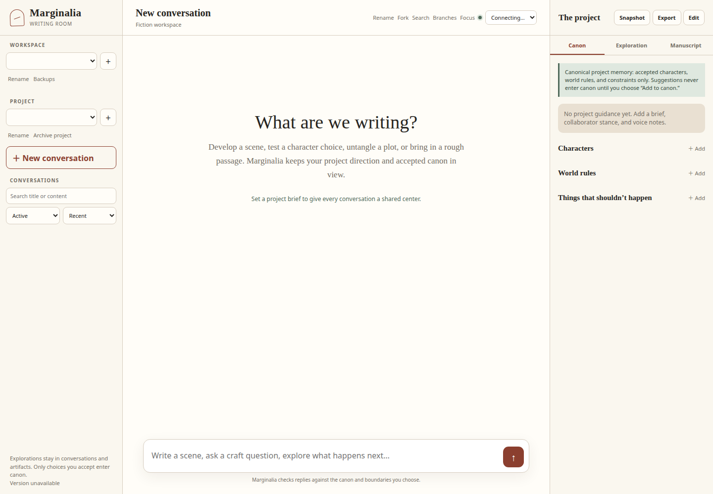

# Marginalia

Marginalia is an AI-assisted writing room for long-form fiction.

It is built for stories that outgrow a chat window: conversations stay
available, exploratory branches do not overwrite each other, characters and
world rules have an explicit home, and model output does not silently become
canon.



_The screenshot uses a synthetic project; no private writing is included._

## Why use it?

A long story is more than its most recent prompt. Marginalia keeps the writing,
the decisions around it, and the material you may want later in one durable
project while preserving a crucial distinction:

> Exploration is not canon. Characters, facts, scenes, and branches become
> established story state only when you explicitly accept or organize them.

You can:

- write in persistent, searchable conversations;
- fork a conversation and return to either branch;
- set project direction, collaborator stance, and voice guidance;
- organize Characters, World Rules, and negative constraints;
- review proposed facts before accepting them into the Story Bible;
- keep drafts, scenes, character sketches, world notes, and other artifacts
  with revision history and source provenance;
- arrange artifacts into manuscript parts, chapters, and scenes;
- follow character backlinks and search across the whole project;
- create named checkpoints;
- compile or export Markdown and DOCX, plus a portable project archive;
- back up and restore a workspace without turning provider failures into story.

Durable generation is part of every supported deployment. Its project-level
switch is visible as **ag-ng · on/off** in the application header and is also
the first control in **Project direction → Generation reliability**. It keeps
work in custody across tab disconnects, shows an explicit indeterminate state
while reconciliation continues, and permits an optional fallback only after a
confirmed failure. Turning it off stops new dispatches; it does not abandon or
synchronously reroute work already in custody.

## Install and start writing

Marginalia runs as a local, multi-service Docker Compose appliance. Check out a
versioned release, copy `.env.example` to the ignored `.env`, and configure the
NAS-backed ag-ng inputs described in
[Provider configuration](docs/MODEL_PROVIDERS.md). Then start the exact image:

```bash
docker compose up -d
```

For a source build, `./start.sh` exports the exact pinned ag-ng and Docket Git
objects and builds all services. `./start-codex.sh` additionally performs Codex
device login inside ag-providerd's isolated auth volume.

Everyday lifecycle commands are standard Compose operations:

```bash
docker compose up -d
docker compose ps
docker compose logs --tail=100
docker compose down
```

Stopping or replacing containers does not delete named-volume writing. The
classic single-container launcher and installer fail closed because they cannot
provide ag-ng authorization plus Docket custody.

## What the writing room keeps track of

Each project has its own conversations, direction, canon, artifacts, and
manuscript organization. Lightweight workspaces group projects for household
use; they are organizational partitions, not user accounts or security
boundaries.

Conversation forks retain their parent and fork point. Saved artifacts retain
their source conversation and message IDs. Manuscript nodes reference
artifacts instead of copying them, so rearranging the book does not silently
create a second authoritative draft. Artifact working copies autosave
separately from committed revisions, and deleting through the UI moves an
artifact to reversible trash.

Story Bible capture is explicit. Marginalia can identify a candidate fact or
character detail, but review and acceptance are separate actions. Search,
backlinks, compilation, and export likewise read existing state without
promoting exploratory text to canon.

## Models, privacy, and governance

Marginalia can use configured hosted or local model routes. A deployment may
offer Codex, Claude Code, Kimi Code, Ollama, OpenAI-compatible APIs, or
Anthropic's API; the exact choices depend on the installation.

Durable project and writing state is stored locally by the appliance. When you
generate with a hosted provider, Marginalia sends the context needed for that
generation to the selected provider. Local storage does not imply local
inference.

ag-ng authorizes each exact provider dispatch, Docket owns attempt custody, and
ag-providerd isolates provider credentials. That authorization is not a promise
that model output is true or good. Marginalia keeps each response provisional
until application acceptance atomically validates the exact conversation
revision, canon, and project guidance from which it was generated.

Provider and model setup is documented in
[MODEL_PROVIDERS.md](docs/MODEL_PROVIDERS.md).

## Reliability and continuity

Marginalia preserves complete durable history while building bounded,
token-counted generation context for long-running stories. Older passages may
be represented by a source-linked derived summary, while recent authored turns,
accepted canon, project direction, and the pending prompt remain explicit.

Provider, transport, timeout, malformed-result, cancellation, and stale-session
outcomes remain operational state. They may be shown as a failure card, but
they cannot become assistant prose, canon, an artifact, or subsequent narrative
context. A failed prompt remains a browser draft so it can be retried without
contaminating the story.

See [RELIABILITY.md](docs/RELIABILITY.md) for the exact generation,
concurrency, timeout, and context-budget contracts.
Deployment activation, separate key recovery, and rollback checks are in
[Gate 3 durable generation operations](docs/gate3/DURABLE-GENERATION-OPERATIONS.md).
The writer-facing switch, recovery states, and usage/cost labels are introduced
in [Durable generation: writer onboarding](docs/gate3/ERIN-DURABLE-GENERATION.md).

## Your data, backups, and exports

Writing lives in a Docker-managed data volume, separate from model login state.
Normal stop, start, and update operations retain both. Project export produces
readable Markdown, compiled manuscript output, canon and project direction,
and a complete machine-readable project record.

Workspace backups are checksummed archives that include project context,
sessions, artifacts, snapshots, and the derived context files needed by the
current appliance. Restore rehearsal rebuilds into a temporary empty root and
validates the records before any disaster restore is attempted. Operators
should never restore over the live volume.

See [OPERATIONS.md](docs/OPERATIONS.md) for backup destinations, verification,
restore rehearsal, health endpoints, and bounded-context rollout.

## For developers

Contributor setup, repository history, donor-route quarantine, runtime
ownership, exact dependency pins, container development, and verification
commands are in [DEVELOPMENT.md](docs/DEVELOPMENT.md).

Further technical references:

- [Architecture](ARCHITECTURE.md)
- [API contract](docs/API.md)
- [ag-ng execution contract](AG_CONTRACT.md)
- [Distribution and release](docs/DISTRIBUTION.md)
- [Provider configuration](docs/MODEL_PROVIDERS.md)
- [Reliability](docs/RELIABILITY.md)
- [Operations and recovery](docs/OPERATIONS.md)
- [Durable-generation writer onboarding](docs/gate3/ERIN-DURABLE-GENERATION.md)
- [Qualified baseline and next work](docs/NEXT_WORK.md)
- [Provenance](PROVENANCE.md)

## License

Marginalia is licensed under Apache 2.0. See [LICENSE](LICENSE) and
[NOTICE](NOTICE).
